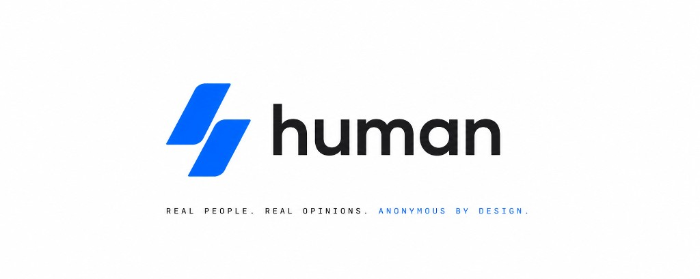

<div align="center">



<br /><br />

[![app][app-shield]][app-link]
[![github][github-shield]][github-link]
[![pitch deck][pitch-deck-shield]][pitch-deck-link]
[![github stars][github-star]][repo-link]
[![built on stellar][stellar-shield]][stellar-link]
[![pulso hackathon][pulso-shield]][pulso-link]

</div>

### 👋 Bienvenidos a ACRC-Zk

Estamos construyendo **human** — la comunidad donde personas **reales y verificadas** dicen lo que no se animan a decir con su nombre, bajo un **seudónimo anónimo** que protege tu identidad real por diseño.

Hoy elegís entre dos males: o te exponés con tu nombre, o no sabés a quién le creés en el anónimo. Reddit y los foros están llenos de bots; cada plataforma guarda una copia de tus datos. **human** te da las dos cosas que importan: **confianza y protección a la vez** — probás que sos una persona real y única, con privacidad criptográfica, no solo “confiá en nosotros”.

Construido sobre **Stellar** (Soroban + pruebas ZK Groth16) para el **PULSO Hackathon**. El repositorio abierto es el monorepo **beHuman** — verificación en testnet hoy, infraestructura de personhood para todo el ecosistema mañana.

### ⭐️ Nuestro proyecto

| Proyecto | Descripción |
| :--- | :--- |
| [**🧑‍🤝‍🧑 beHuman**][repo-link] | Monorepo completo: KYC-ZK en el navegador, contratos Soroban, plataforma de opinión anónima, curaduría IA + moderación humana, funding ZK exploratorio. Verificación en vivo en testnet · feed de personas verificadas · anti-Sybil: 1 humano = 1 cuenta. [![][app-shield]][app-link] [![][contract-shield]][contract-link] |

### 📦 Ecosistema (monorepo)

| Carpeta / paquete | Propósito | Capa | Lenguaje |
| :--- | :--- | :---: | :---: |
| [**beHuman**][repo-link] | Monorepo único — identidad, plataforma, funding, web, SDK | — | — |
| `identity/circuits/` | Circuito Circom `kyc.circom` — commitment, nullifier, issuer root (BLS12-381) | 1 | ![][lang-circom] |
| `identity/contracts/kyc_verifier/` | Soroban: `verify_and_register`, `is_verified(address)` ← **el puente** | 1 | ![][lang-rust] |
| `identity/issuer/` | Issuer KYC **mock** (firma credenciales; no es KYC real) | 1 | ![][lang-typescript] |
| `platform/circuits/` | Circuito `post.circom` — identidad anónima `platformId` + binding de contenido | 2 | ![][lang-circom] |
| `platform/contracts/opinion_board/` | Soroban: ancla on-chain (autor verificado + hash del post) | 2 | ![][lang-rust] |
| `platform/api/` | Backend: feed, posts, perfiles, contenido off-chain | 2 | ![][lang-typescript] |
| `platform/curation/` | Agentes validadores (Claude API) + cola de moderación humana | 2 | ![][lang-typescript] |
| `funding/circuits/` | `funding_opinion.circom` — opinión anónima por campaña (nullifier scopeado) | 3 | ![][lang-circom] |
| `funding/contracts/campaign_controller/` | Soroban no-custodial: donación, release 2-de-3, refund todo-o-nada | 3 | ![][lang-rust] |
| `funding/api/` | Orquestación DeFindex (yield) + Trustless Work (escrow) | 3 | ![][lang-typescript] |
| `packages/sdk/` | Prover + orquestación de tx Stellar (compartido) | — | ![][lang-typescript] |
| `packages/shared/` | Tipos TS compartidos (identidad + plataforma + funding) | — | ![][lang-typescript] |
| `web/` | Frontend único React + Vite — landing, KYC, feed, causas | — | ![][lang-typescript] |

### 🏗️ Cómo encaja todo

```
                         human (web · React + Vite)
                                    │
              ┌─────────────────────┼─────────────────────┐
              │                     │                     │
        documento +            prueba ZK en           seudónimo
        rostro (local)         el navegador          anónimo
              │                     │                     │
              ▼                     ▼                     ▼
       ┌─────────────┐      ┌─────────────┐      ┌─────────────┐
       │  Issuer     │      │  Soroban    │      │  opinion_   │
       │  mock       │      │ kyc_verifier│      │  board      │
       │  (off-chain)│      │  (Capa 1)   │      │  (Capa 2)   │
       └─────────────┘      └──────┬──────┘      └──────┬──────┘
                                   │                    │
                          is_verified(address)    platformId + hash
                                   │                    │
                                   └────────┬───────────┘
                                            ▼
                                   platform/api (feed off-chain)
                                            │
                                   platform/curation (IA + humanos)
                                            │
                              ┌─────────────┴─────────────┐
                              ▼                           ▼
                    campaign_controller            DeFindex + Blend
                    (Capa 3 · funding ZK)        (yield en testnet)
```

**Flujo de verificación (Capa 1):** subís documento y selfie en vivo → la prueba se genera en tu navegador → `verify_and_register` en Stellar testnet → quedás verificado **sin exponer tus datos**. Tus datos nunca salen de tu dispositivo; a la red solo llega la prueba.

**Flujo de opinión (Capa 2):** con credencial Capa 1 en el device → `platformId = Poseidon(secret, scope)` → publicás bajo seudónimo → contenido off-chain + ancla on-chain. El fee lo paga una cuenta efímera; tu address de KYC no aparece en la plataforma.

**Regla de oro:** humano real = sí · identificable = no.

### 🎯 Qué hace diferente a human

| | Con tu nombre | Anónimo de hoy (Reddit, foros) | KYC tradicional | **human** |
| :--- | :--- | :--- | :--- | :--- |
| Podés opinar en serio | Sí, pero te exponés | Sí, pero ¿es humano o bot? | Controlado, pero tus datos quedan en otro servidor | **Sí, sin exponerte** |
| Sabés que hay una persona real | Sí | No | Sí | **Sí** |
| Privacidad real | No | Parcial | No (PII centralizada) | **Criptográfica** |
| 1 persona = 1 cuenta | No garantizado | No | Sí, pero con datos expuestos | **Sí, sin PII on-chain** |
| La plataforma puede linkearte | Sí | A veces | Sí | **No por diseño** |

**Tagline:** *"Hablá con la verdad. Sin que te cueste caro."*

**La ventaja:** Reddit no sabe si sos humano. X te hace elegir entre exponerte o un check que no prueba nada. Nadie junta las dos cosas que importan — **human sí**.

### ⚔️ Producto (estado actual)

- **Verificación ZK:** documento argentino + rostro en vivo → prueba Groth16 en el navegador → registro en Soroban testnet.
- **Anti-Sybil:** nullifier on-chain — una persona, una identidad; sin bots ni granjas de cuentas.
- **Plataforma anónima:** feed de personas verificadas, opiniones, artículos, estudios, hilos y mensajes bajo `platformId`.
- **Seudónimo estable:** continuidad y reputación sin revelar PII; handle público derivado del `platformId`.
- **Curaduría:** agente IA (primer filtro) + moderación humana (casos ambiguos) — respeto sin censura de ideas legítimas.
- **Acceso simple:** con **Pollar** — del login social al pago en Stellar, sin wallet obligatoria al inicio.
- **Funding ZK (exploratorio):** donación y opinión anónima por campaña con reglas on-chain (release 2-de-3, refund todo-o-nada).
- **i18n:** español e inglés en la web.

> ⚠️ El issuer de Capa 1 es un **mock** (no KYC real con proveedor regulado). Pensado para Argentina primero; el dolor es universal.

### 🔗 On-chain (Stellar testnet)

| | |
| :--- | :--- |
| **kyc_verifier** | Desplegar con `bash scripts/deploy_testnet.sh` → `KYC_VERIFIER_CONTRACT_ID` |
| **opinion_board** (e2e) | [`CD2XVZTQTQZL3LU4E6PH7EXDGV2VX6KNAN2L3TROKJAR6U45SC2K2T6M`][opinion-e2e-link] |
| **opinion_board** (demo front) | [`CAZOMMMZSKI2EHH6PHP53NJ3K4DGAJ4JBRAR4HPVNN2QJ4VIF7WJKOQK`][opinion-demo-link] |
| **campaign_controller** (demo) | [`CB5NYUPBHDNTSN7MVJOALELTIY4BXGPTGUR6JPA7SQSZRTA46G6GIOAM`][campaign-link] |
| **Red** | `testnet` |
| **RPC** | `https://soroban-testnet.stellar.org` |
| **Passphrase** | `Test SDF Network ; September 2015` |
| **Explorer** | [stellar.expert testnet][explorer-link] |
| **Faucet** | [friendbot.stellar.org][faucet-link] |

Friendbot fondea cuentas efímeras en testnet para que cualquiera pueda probar sin wallet previa.

### 🗺️ Roadmap

| Fase | Qué incluye |
| :--- | :--- |
| **Ahora · testnet** | Verificación de humanidad en vivo · comunidad anónima funcionando · anti-Sybil 1 persona = 1 cuenta |
| **Próximo** | Capa de apoyo a causas con Blend v2 · apelaciones y gobernanza de moderación · nuevas verticales |
| **Después** | Salto a mainnet en Stellar · issuer KYC con proveedor real · **SDK abierto**: human como infraestructura para todo el ecosistema |

### 💼 Modelo de negocio (siguiente fase)

Hoy validamos el problema. Cuando escalemos, dos motores:

| Segmento | Modelo |
| :--- | :--- |
| **B2C · usuarios** | Suscripción premium estilo X: perfil destacado, mayor alcance, herramientas para quienes opinan en serio |
| **B2B · ecosistema** | Verificación como servicio — otras apps de Stellar pagan por usar el kit de personhood (`is_verified`) |

También exploramos: artículos con sello de veracidad · comisión sobre apoyo a causas.

### 🌍 Mercado

- **Argentina primero:** documento local, entrevistas con usuarios de la región, mercado que entendemos de verdad.
- **El dolor es universal:** casi todos alguna vez nos callamos algo por miedo a que quede con nuestro nombre.
- **Latinoamérica después:** +450M de personas con internet comparten el mismo problema — mismo producto, más mercado.

### 🙋 El ask

No te pedimos plata. Te pedimos tu opinión.

1. **Registrate** — entrá y verificate en un minuto. Una persona, una identidad anónima.
2. **Probá la app** — publicá una opinión, recorré el feed, sentí lo que se siente hablar sin exponerte.
3. **Danos feedback** — qué falla, qué falta, a quién se lo recomendarías.

```bash
git clone https://github.com/ACRC-Zk/beHuman.git && cd beHuman
npm install
npm run dev                    # web en http://localhost:5173
make contracts-build         # contratos Soroban
```

### 🤝 Contributing

Aceptamos PRs, issues y feedback de producto en [beHuman][repo-link].

- **Cripto / contratos** — `identity/contracts`, `platform/contracts`, `funding/contracts` (revisión humana obligatoria en nullifier, address binding, issuer root).
- **Circuitos ZK** — Circom + Groth16 BLS12-381 en `identity/circuits`, `platform/circuits`, `funding/circuits`.
- **Plataforma** — feed, API, curaduría en `platform/` y `web/src/`.
- **Docs de diseño** — vault Obsidian hermana (`obsidian-vault-zk`); este repo es solo código.

Antes de tocar contratos: leé [developers.stellar.org](https://developers.stellar.org) y la skill **zk-proofs** (Groth16 + BLS12-381).

### 🪪 Licencia

Pendiente de definir por repositorio. Hackathon requiere código open-source.

---

> [!TIP]
>
> **Probá ahora:** cloná [beHuman][repo-link] → validá tu identidad en testnet → publicá bajo seudónimo → recorré el feed de humanos reales. Una persona real. Una sola vez. Identidad humana, verificable y privada, simple de usar y sobre Stellar.

[app-link]: https://github.com/ACRC-Zk/beHuman#-quickstart
[app-shield]: https://img.shields.io/badge/app-beHuman-0EA5E9?labelColor=0A0A0A&style=flat-square&logo=react&logoColor=white

[github-link]: https://github.com/ACRC-Zk
[github-shield]: https://img.shields.io/badge/org-ACRC--Zk-0EA5E9?labelColor=0A0A0A&style=flat-square&logo=github&logoColor=white

[repo-link]: https://github.com/ACRC-Zk/beHuman
[github-star]: https://img.shields.io/github/stars/ACRC-Zk/beHuman?color=0EA5E9&labelColor=0A0A0A&style=flat-square&logo=github

[pitch-deck-link]: https://github.com/ACRC-Zk
[pitch-deck-shield]: https://img.shields.io/badge/pitch%20deck-view-0EA5E9?labelColor=0A0A0A&style=flat-square&logo=googleslides&logoColor=white

[stellar-link]: https://stellar.org
[stellar-shield]: https://img.shields.io/badge/built%20on-Stellar-0EA5E9?labelColor=0A0A0A&style=flat-square&logo=stellar&logoColor=white

[pulso-link]: https://github.com/ACRC-Zk/beHuman
[pulso-shield]: https://img.shields.io/badge/hackathon-PULSO%202026-0EA5E9?labelColor=0A0A0A&style=flat-square

[contract-link]: https://stellar.expert/explorer/testnet
[contract-shield]: https://img.shields.io/badge/contracts-testnet-0EA5E9?labelColor=0A0A0A&style=flat-square&logo=ethereum&logoColor=white

[opinion-e2e-link]: https://stellar.expert/explorer/testnet/contract/CD2XVZTQTQZL3LU4E6PH7EXDGV2VX6KNAN2L3TROKJAR6U45SC2K2T6M
[opinion-demo-link]: https://stellar.expert/explorer/testnet/contract/CAZOMMMZSKI2EHH6PHP53NJ3K4DGAJ4JBRAR4HPVNN2QJ4VIF7WJKOQK
[campaign-link]: https://stellar.expert/explorer/testnet/contract/CB5NYUPBHDNTSN7MVJOALELTIY4BXGPTGUR6JPA7SQSZRTA46G6GIOAM

[explorer-link]: https://stellar.expert/explorer/testnet
[faucet-link]: https://friendbot.stellar.org

[lang-typescript]: https://img.shields.io/badge/typescript-0EA5E9?labelColor=0A0A0A&style=flat-square&logo=typescript&logoColor=white
[lang-rust]: https://img.shields.io/badge/rust-0EA5E9?labelColor=0A0A0A&style=flat-square&logo=rust&logoColor=white
[lang-circom]: https://img.shields.io/badge/circom-0EA5E9?labelColor=0A0A0A&style=flat-square&logo=zig&logoColor=white
